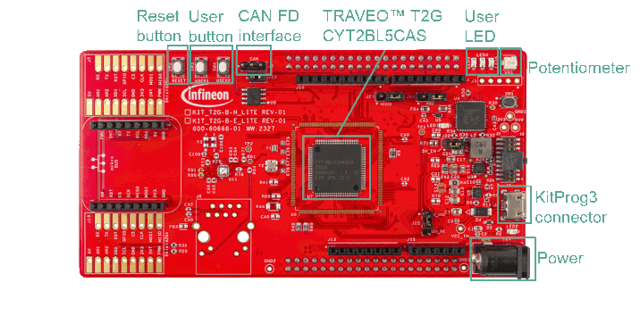
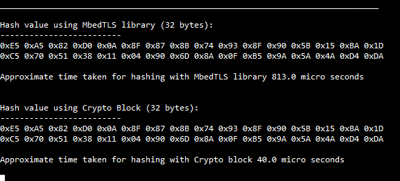

# CRYPTO Performance Measurement
**This code example shows the performance differences of crypto hardware block and the one that is performed by CPU. The result should be printed to the terminal along with the approximate time taken for each method.**  

## Device
The device used in this code example (CE) is:
- [TRAVEO™ T2G CYT4BF Series](https://www.infineon.com/cms/en/product/microcontroller/32-bit-traveo-t2g-arm-cortex-microcontroller/32-bit-traveo-t2g-arm-cortex-for-body/traveo-t2g-cyt4bf-series/)
- [TRAVEO™ T2G CYT2BL Series](https://www.infineon.com/cms/en/product/microcontroller/32-bit-traveo-t2g-arm-cortex-microcontroller/32-bit-traveo-t2g-arm-cortex-for-body/traveo-t2g-cyt2bl-series/)

## Board
The board used for testing is:
- TRAVEO&trade; T2G evaluation kit ([KIT_T2G-B-H_EVK](https://www.infineon.com/cms/en/product/evaluation-boards/kit_t2g-b-h_evk/), [KIT_T2G-B-H_LITE](https://www.infineon.com/cms/en/product/evaluation-boards/kit_t2g-b-h_lite/))
- TRAVEO&trade; T2G Body Entry Lite evaluation kit ([KIT_T2G-B-E_LITE](https://www.infineon.com/cms/en/product/evaluation-boards/kit_t2g-b-e_lite/))

## Scope of work

In this example, the performance is analyzed while generating a 32-byte hash value or message digest for a given data with the SHA256 algorithm using the Cryptographic hardware block in the MCU. The cipher procedure on CPU is done by *MbedTLS* library.

## Introduction

**Cryptography Block**  

- Supports Enhanced Secure Hardware Extension (eSHE) and Hardware Security Module (HSM)
- Secure boot and authentication
    - Using digital signature verification
    - Using fast secure boot
- AES: 128-bit blocks, 128-/192-/256-bit keys
- 3DES: 64-bit blocks, 64-bit key
- Vector unit supporting asymmetric key cryptography such as Rivest-Shamir-Adleman (RSA) and Elliptic Curve (ECC)
- SHA-1/2/3: SHA-512, SHA-256, SHA-160 with variable length input data
- CRC: supports CCITT CRC16 and IEEE-802.3 CRC32
- True random number generator (TRNG) and pseudo random number generator (PRNG)
- Galois/Counter Mode (GCM)

More details can be found in:
- TRAVEO&trade; T2G CYT4BF Series
  - [Technical Reference Manual (TRM)](https://www.infineon.com/dgdl/?fileId=5546d4627600a6bc017600bfae720007)
  - [Registers TRM](https://www.infineon.com/dgdl/?fileId=5546d4627600a6bc017600be2aef0004)
  - [Data Sheet](https://www.infineon.com/dgdl/?fileId=5546d46275b79adb0175dc8387f93228)
- TRAVEO&trade; T2G CYT2BL Series
  - [Technical Reference Manual (TRM)](https://www.infineon.com/dgdl/?fileId=5546d462766cbe860176804ea8d27e9b)
  - [Registers TRM](https://www.infineon.com/dgdl/?fileId=5546d4627600a6bc017600b9a0ca0000)
  - [Data Sheet](https://www.infineon.com/dgdl/?fileId=8ac78c8c82ce566401836c4d5e9a46c8)

## Hardware setup
This CE has been developed for:
- TRAVEO&trade; T2G evaluation kit ([KIT_T2G-B-H_EVK](https://www.infineon.com/cms/en/product/evaluation-boards/kit_t2g-b-h_evk/)) 
 

- TRAVEO&trade; T2G Body High Lite evaluation kit ([KIT_T2G-B-H_LITE](https://www.infineon.com/cms/en/product/evaluation-boards/kit_t2g-b-h_lite/)) 
 

- TRAVEO&trade; T2G Body Entry Lite evaluation kit ([KIT_T2G-B-E_LITE](https://www.infineon.com/cms/en/product/evaluation-boards/kit_t2g-b-e_lite/)) 
 
  
The example uses the default configuration of the board. Refer to the kit user guide to verify that the board is properly configured.

## Implementation

In this example, the message with size 256 Bytes is hardcoded. A 32-byte long hash value is generated using the SHA-256 algorithm. The 32-byte hash value generated for the given message using *MbedTLS* library and crypto block is then displayed on the UART terminal emulator along with the approximate time taken for generating the hash values calculated using TCPWM counter.

**SHA-256 Calculation**  
- **Crypto hardware**
    - Enable the Crypto hardware core using <a href="https://infineon.github.io/mtb-pdl-cat1/pdl_api_reference_manual/html/group__group__crypto__lld__hw__functions.html#ga6aede3754a84e01d5e9b4227a683c24c"><i>Cy_Crypto_Core_Enable()</i></a>
    - <a href="https://infineon.github.io/mtb-pdl-cat1/pdl_api_reference_manual/html/group__group__crypto__lld__sha__functions.html#ga3023d5535203528b0ef7136c86f8a66c"><i>Cy_Crypto_Core_Sha()</i></a> performs hash value generation over specified data of length
    - Please refer [here](https://infineon.github.io/mtb-pdl-cat1/pdl_api_reference_manual/html/group__group__crypto.html) for detailed explanation of PDL API usage for Crypto
- **CPU (MbedTLS library)**
    - A series of processing steps are contained in the *ComputeHash()* function. For details about MbedTLS, please refer the README on [here](https://github.com/Mbed-TLS/mbedtls)
    - MTB provides a library named *mbedTLS Crypto acceleration* which provides the same interface with MbedTLS which can use the Crypto hardware in its computation. A SHA-256 calculation is supported and available in this code example. To use this feature, delete the definition of *DISABLE_MBEDTLS_ACCELERATION* in the project *Makefile*
    - However, the library does not support the full set of the hardware features. For details, check the README on [here](https://github.com/Infineon/cy-mbedtls-acceleration)

**Time Measurement**  
- This code example uses TCPWM to measure the time required for SHA256 operations
    - Initialize the Timer Counter Pulse Width Modulator (TCPWM) counter mode using <a href="https://infineon.github.io/mtb-pdl-cat1/pdl_api_reference_manual/html/group__group__tcpwm__functions__counter.html#ga6068a06ddc8a07c67bb6df86e920944c"><i>Cy_TCPWM_Counter_Init()</i></a>
    - Enable TCPWM counter using <a href="https://infineon.github.io/mtb-pdl-cat1/pdl_api_reference_manual/html/group__group__tcpwm__functions__counter.html#ga1707e2cc291fe486fbea346157c65bff"><i>Cy_TCPWM_Counter_Enable()</i></a>
    - The operations to start measurement is contained in *StartCounting()* function
        - Clear the counter by <a href="https://infineon.github.io/mtb-pdl-cat1/pdl_api_reference_manual/html/group__group__tcpwm__functions__pwm.html#gafa477f61cb9fdb4538afa60c6b3f3ce8"><i>Cy_TCPWM_PWM_SetCounter()</i></a> before start counting
        - <a href="https://infineon.github.io/mtb-pdl-cat1/pdl_api_reference_manual/html/group__group__tcpwm__functions__common.html#gaafe86ec440bec9a2c23392f289cc3a8b"><i>Cy_TCPWM_TriggerStart_Single()</i></a> inputs software trigger to start the counter
    - Similarly, measurement is stopped by *StopCounting()*
        - <a href="https://infineon.github.io/mtb-pdl-cat1/pdl_api_reference_manual/html/group__group__tcpwm__functions__common.html#gad1459b0ddabf388afe151de57f7cf4d4"><i>Cy_TCPWM_TriggerStopOrKill_Single()</i></a> stops the counting operation of TCPWM
    - The time taken for each SHA-256 calculation can be obtained in microseconds by *GetTimeTaken()*
        - <a href="https://infineon.github.io/mtb-pdl-cat1/pdl_api_reference_manual/html/group__group__tcpwm__functions__counter.html#ga216478872f4b0b65f89691ea577286bb"><i>Cy_TCPWM_Counter_GetCounter()</i></a> returns the counter value

**Miscellaneous settings**  

- **STDOUT setting**

  - Calling <a href="https://infineon.github.io/retarget-io/html/group__group__board__libs.html#gaddff65f18135a8491811ee3886e69707"><i>cy_retarget_io_init()</i></a> function to use UART as STDIN / STDOUT
    - Initialize the port defined as *CYBSP_DEBUG_UART_TX* as UART TX and *CYBSP_DEBUG_UART_RX* as UART RX (these pins are connected to KitProg3 COM port)
    - The serial port parameters are 8N1 and 115200 baudrate

## Compiling and programming
Before testing this code example:

- Connect the board to your PC using the provided USB cable through the KitProg3 USB connector
- Build the project using the dedicated Build button  or by right-clicking the project name and selecting "Build Project"

## Run and Test
For this example, a terminal emulator is required to display outputs and receive keys pressed. You can install a terminal emulator if you do not have one. In this example, Tera Term was used as the terminal emulator.

After code compilation, perform the following steps to flashing the device:

1. Open a terminal program and select the KitProg3 COM port. Set the serial port parameters to 8N1 and 115200 baud
2. Program the board using one of the following:
    - Select the code example project in the Project Explorer
    - In the **Quick Panel**, scroll down, and click **[Project Name] Program (KitProg3_MiniProg4)**
3. After programming, the code example starts automatically
4. The result will be shown as in below figure
    **Figure: Terminal Output** 
    

## Debug Mode
You can debug the example to step through the code. In the IDE, use the \<Application Name> Debug (KitProg3_MiniProg4) configuration in the Quick Panel.For details, see the "Program and debug" section in the [Eclipse IDE for ModusToolbox™ software user guide](https://www.infineon.com/dgdl/?fileId=8ac78c8c8386267f0183a8d7043b58ee)

**Note:** **(Only while debugging)** On the CM7 CPU, some code in *main()* may execute before the debugger halts at the beginning of *main()*. This means that some code executes twice: once before the debugger stops execution, and again after the debugger resets the program counter to the beginning of *main()*. See [KBA231071](https://community.infineon.com/t5/Knowledge-Base-Articles/PSoC-6-MCU-Code-in-main-executes-before-the-debugger-halts-at-the-first-line-of/ta-p/253856) to learn about this and for the workaround.

## References  
Relevant Application notes are:
- [AN235305](https://www.infineon.com/dgdl/?fileId=8ac78c8c8b6555fe018c1fddd8a72801) - Getting started with TRAVEO&trade; T2G family MCUs in ModusToolbox&trade;
- [AN220253](https://www.infineon.com/dgdl/?fileId=8ac78c8c7cdc391c017d0d3b144c679e) - Using the CRYPTO Module in TRAVEO&trade; II Family

ModusToolbox&trade; is available online:
- <https://www.infineon.com/modustoolbox>

Associated TRAVEO&trade; T2G MCUs can be found on:
- <https://www.infineon.com/cms/en/product/microcontroller/32-bit-traveo-t2g-arm-cortex-microcontroller/>

More code examples can be found on the GIT repository:
- [TRAVEO™ T2G Code examples](https://github.com/orgs/Infineon/repositories?q=mtb-t2g-&type=all&language=&sort=)

For additional trainings, visit our webpage:  
- [TRAVEO™ T2G trainings](https://www.infineon.com/cms/en/product/microcontroller/32-bit-traveo-t2g-arm-cortex-microcontroller/32-bit-traveo-t2g-arm-cortex-for-body/traveo-t2g-cyt4bf-series/#!trainings)

For questions and support, use the TRAVEO&trade; T2G Forum:  
- <https://community.infineon.com/t5/TRAVEO-T2G/bd-p/TraveoII>
